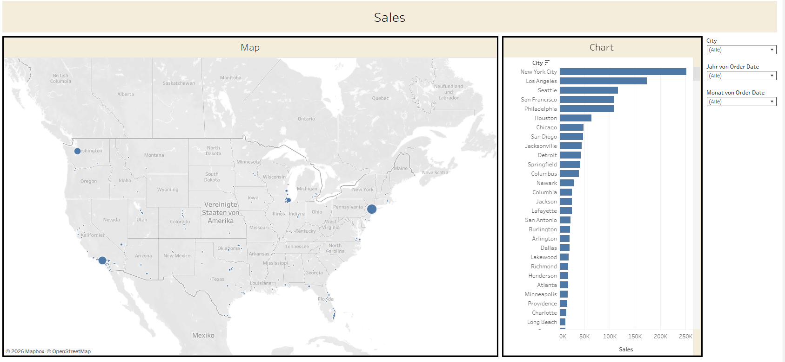
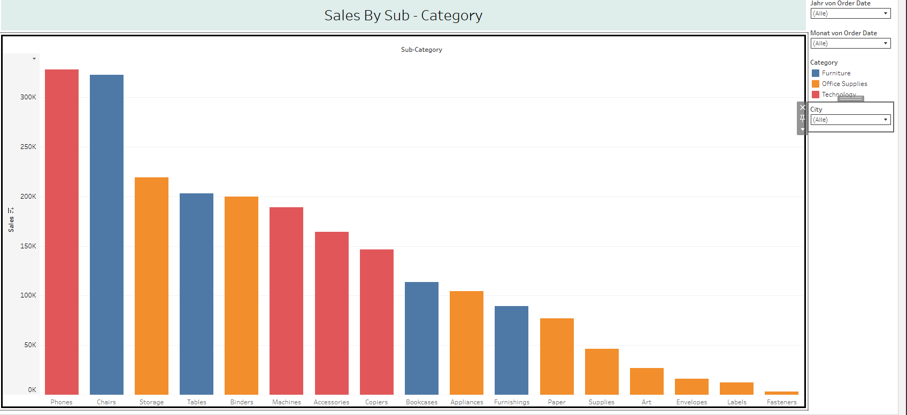
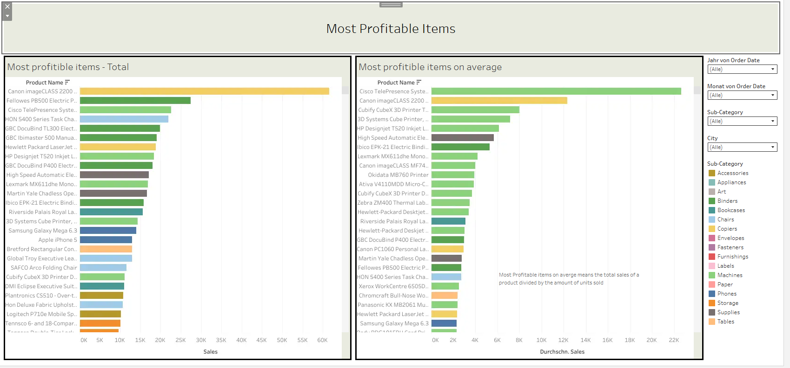

# Sales Dashboard 

This project contains dashboards regarding:

- **Sales By City** – shows the total sales by city on a map and on a bar chart.
- **Sales By Sub - Category** – displays the sales by subcategory.
- **Most Profitable Items** – shows the most profitable items in total and on average.

You can view the dashboards on Tableau Public:
**Dashboard Link:  https://public.tableau.com/app/profile/timur.kaygusuz/viz/SalesDashboard_17897459573670/MostProfitableItems**

## 1. Sales By City

On a map the location of each city is drawn as a circle where the size of the circle corresponds to the sales made in that city 
 
This dashboard allows you to filter by:
- city 
- year of order date
- month of order date

  

## 2. Sales By Sub - Category

This dashboard shows the total sales by subcategory in a bar chart 

This dashboard allows you to filter by:
- city 
- year of order date
- month of order date

  

## 3. Most Profitable Items 

This dashboard shows the most profitable items by total sale and average sale both in bar charts

This dashboard allows you to filter by:
- city 
- sub - category
- year of order date
- month of order date

  

## 4. Data Source 

Superstore Sales Dataset: https://www.kaggle.com/datasets/rohitsahoo/sales-forecasting

 
the dataset contains sales data from a global superstore

